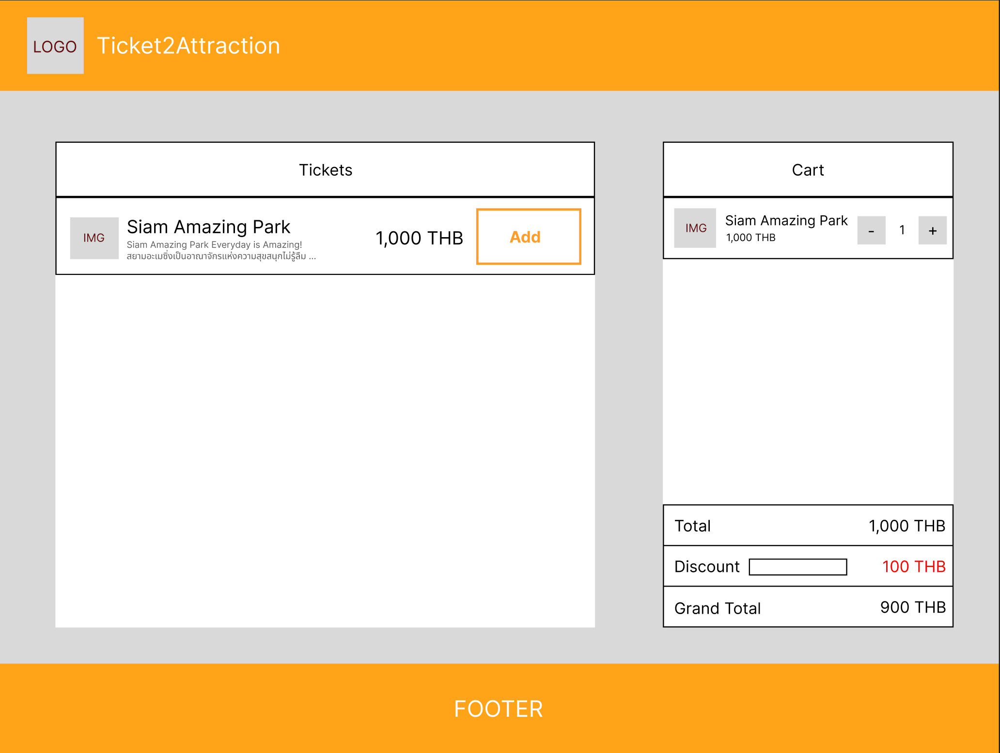

# INTERVIEW TEST

## Introduce

The client is rushing to launch new project on next week, The backend team is on vacation at Ibiza beach, that's why you are the only one who can save the day!.

## Problems

- We implementing a checkout page.
- Create a list of ticket and cart checkout.
- You can refactor anyway you want.
- Try to build reusable hook for delegate between mock and API.
- We only have API mock (which is also incomplete).
- (Optional) So you need to create API Server also.

## Requirements
- As a user, I want to see a list of tickets.
- As a user, I want to pick as many tickets as I want.
- As a user, I want to update the quantity of each ticket in the cart.
- As a user, I want to see the total amount of the cart.
- As a user, I want to refresh the page without resetting the cart.
- As a user, I want to apply a discount coupon.
- (Optional) As a user, I want to search ticket by title.
- (Optional) As a user, I want to sorting ticket by price, title.

## Feature Checklist
- Completed API mock (both discount and ticket).
- Create hook for the api (both discount and ticket).
- Can add product.
- Can adjust quantity.
- Calculate discount.
- Display total price correctly.
- (Extra) Create API server (By convert this prodject into next.js is fine).

## Wireframe

- Have Tickets Component on the left and Cart Component on the right
  

## Nice to Have

- Unit Tests
- Component reusable

## Project Submission

- Clone this respository and create your own git (gitlab/github)
- Reply email with git url
